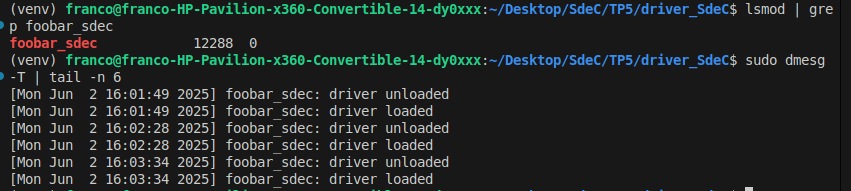

# Informe del Proyecto: Driver de Caracteres y Aplicación de Usuario

## Introducción
Este informe detalla el desarrollo de un **Driver de Caracteres** (CDD) y una aplicación de usuario para sensar y graficar señales externas. El proyecto cumple con los requisitos establecidos en el trabajo práctico (TP), incluyendo la implementación de un driver que administra señales externas y una aplicación que permite la selección y visualización de dichas señales.

---

## Objetivos del Proyecto
1. Diseñar y construir un **Driver de Caracteres** que permita sensar dos señales externas con un período de **un segundo**.
2. Implementar una aplicación de usuario que:
   - Lea **una** de las señales sensadas.
   - Grafique la señal en función del tiempo.
   - Permita seleccionar cuál señal leer.
   - Realice correcciones de escala de las mediciones, si es necesario.

---

## Desarrollo del Driver de Caracteres

### Funcionalidad del Driver
El driver (`foobar_sdec.c`) implementa las siguientes señales:
- **Señal Cuadrada:** Alterna entre 0 y 1 con un período configurable.
- **Señal Triangular:** Incrementa o decrementa su valor entre 0 y 100, alternando dirección al alcanzar los límites.
- **Señal Diente de Sierra:** Incrementa su valor de 0 a 100 y se reinicia al alcanzar el límite.

#### **Código Relevante**
El driver utiliza un temporizador (`timer_list`) para actualizar las señales periódicamente. A continuación, se muestra un fragmento del código que actualiza las señales:
```c
static void update_signals(struct timer_list *t) {
    mutex_lock(&signal_mutex);

    // Actualización de la señal cuadrada
    if (time_after(jiffies, last_square_jiffies + msecs_to_jiffies(SQUARE_PERIOD_MS))) {
        square_state = !square_state;
        last_square_jiffies = jiffies;
    }

    // Actualización de la señal triangular
    triangular_value += triangular_dir * TRIANGULAR_STEP;
    if (triangular_value >= 100 || triangular_value <= 0)
        triangular_dir *= -1;

    // Actualización de la señal diente de sierra
    sawtooth_value += SAWTOOTH_STEP;
    if (sawtooth_value >= 100)
        sawtooth_value = 0;

    mutex_unlock(&signal_mutex);
    mod_timer(&signal_timer, jiffies + msecs_to_jiffies(next_period));
}
```

### Capturas de Pantalla



*Figura 1: Carga y descarga del modulo.*

## Desarrollo de la aplicacion de usuario

### Funcionalidad de la aplicacion
La aplicación (`gui.py`) permite:
- Seleccionar la señal a sensar mediante botones de radio.
- Graficar la señal seleccionada en tiempo real utilizando Matplotlib.
- Resetear el gráfico.


#### **Código Relevante**
La aplicación utiliza PySide6 para la interfaz gráfica y Matplotlib para la visualización de las señales. A continuación, se muestra un fragmento del código que implementa la selección de señales:

```c
def change_signal(self):
    signal = self.signal_group.checkedId()
    self.reader.write_signal(signal)
```


### Capturas de Pantalla


*Figura 2: Visualización de las señales en tiempo real en la aplicacion de usuario.*

